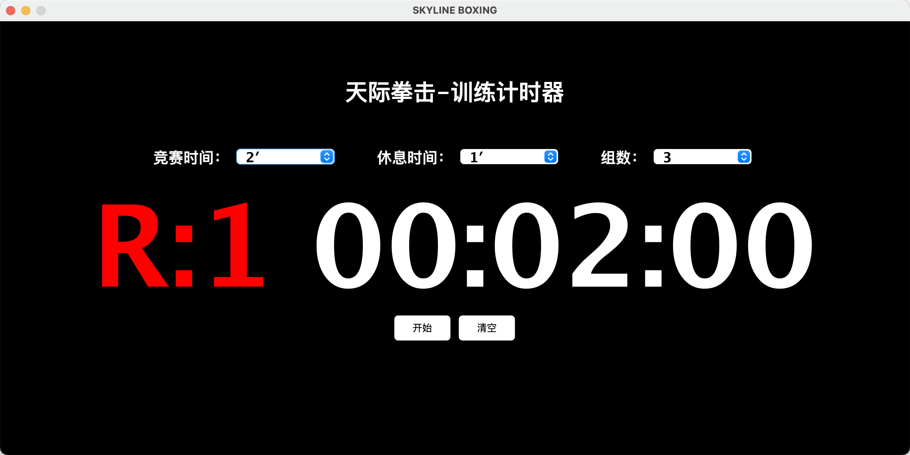

## skyline-timer 拳击训练计时器

本来想买个计时器的，但是有点贵，一个要700多。刚好拳馆里面有个笔记本在吃灰，所以想想自己写个程序吧

基于java swing写的，很简单一个倒计时工具，主要实现拳击比赛或者训练的时间节奏控制：

* 可以设置比赛/训练时间：2分钟、3分钟、5分钟（MMA也可以用哦～）等

* 设置组间休息时间

* 设置组数

然后就可以开始！！！fighting 

另外，我还加了音效，每组开始会ding！ 倒计时10s会ding ding ding！




### 如何使用

docs目录下有个skyline.zip [skyline.zip](docs/skyline.zip) 包，解压后，进到该目录

```java
java -jar skylinetimer.jar
```

每时间做打包和做脚本了，比较临时弄的，也没标准化工程，随便看看。代码没重构过，不要学习。
